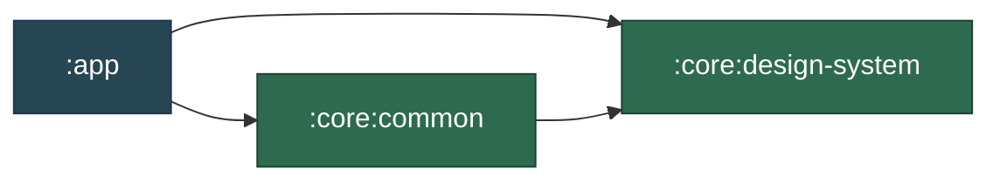
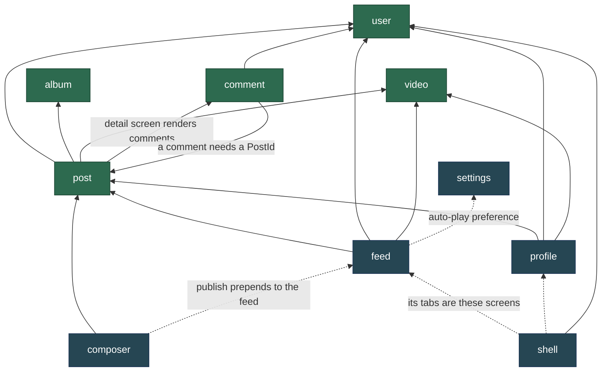
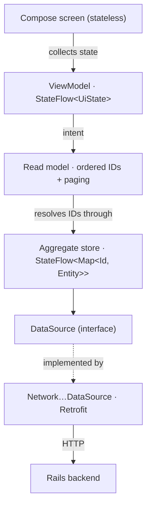
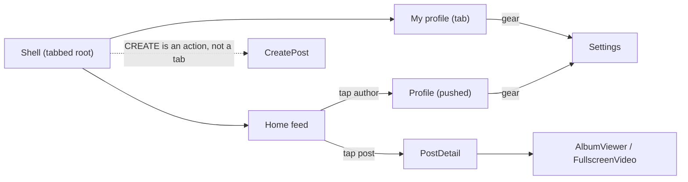

# Mosaic

A portfolio Android app demonstrating modern architecture: single-activity Compose UI, Navigation 3, Hilt DI, MVVM with `StateFlow`, and a Retrofit network layer talking to a Rails backend. Three Gradle modules, configured by convention plugins in an included build.

## Package layout

The top level is **slices, not layers** — layers are the shape *inside* a slice. There is no root `data/` or `ui/` package, and deliberately no `activities/`, `fragments/`, `viewmodels/` or `dialogs/`: **a file's home is decided by what it is *about*, never by what it extends.**

```
:app  ·  uno/lux/mosaic/
├── post/         ─┐
├── user/          │
├── comment/       ├─ aggregates: the entity, its wire types, its store, its UI
├── album/         │
├── video/        ─┘
│
├── feed/         ─┐
├── home/          │
├── profile/       │
├── composer/      ├─ features and read models: they own no entity
├── settings/      │
├── shell/        ─┘
│
└── app/          the machine — MainActivity, MosaicApplication, MosaicApp
    ├── di/           the Hilt modules
    ├── navigation/   the Navigator, the serializable Screen keys, BackStackEntry
    └── fixtures/     stand-in content for previews and DI seeding

:core:common  ·  uno/lux/mosaic/common/
├── ui/           noun-free composables two or more concerns need
├── data/         wire types that describe no single aggregate, plus file loading
└── util/         pure functions with zero project imports

:core:design-system  ·  uno/lux/mosaic/designsystem/
├── theme/        the Mosaic palette, type and gradients
└── components/   branded controls, no domain noun

build-logic/      convention plugins: the SDK levels, Java version and Compose setup, once
```

The two `core` modules are leaves — they own no entity and import no concern, which is what made them extractable without touching a single call site beyond its import. The arrows only point one way, and Gradle is what enforces it:



Every concern stays inside `:app`. Splitting them further would cost the exhaustive `when` over the sealed `Screen` — feature modules cannot see each other's screens — and force the `post ↔ comment` cycle below to be resolved rather than tolerated. `internal` is the reason the two that did come out are worth it: in one module it had never meant anything narrower than "the whole app".

Each slice carries its own layers: `post/data/domain/` holds the entity, `post/data/` the repository and its `DataSource` **interface**, `post/data/network/` the Retrofit service, DTOs, mapper and the `Network…DataSource`, and `post/ui/` the screens. The interface lives beside its *consumer*, not beside its implementation — which is what lets a repository compose a network and a local source without either one owning the contract.

### Aggregates vs. read models

The distinction that keeps the dependency graph acyclic. `post`, `user`, `comment`, `album` and `video` own an entity and everything about it. `feed` and `profile` own no entity — they are read models holding an ordered list of IDs plus paging state, resolved through the aggregate stores. That is why liking a post in the feed updates it on a profile with no re-fetch, and why `ProfileRepository` *composes* `PostRepository` rather than duplicating it.



> Features may depend on aggregates. **Aggregates never depend on features.**

`user`, `album`, `video` and `settings` are leaves — they import nothing from another slice. `album` and `video` are aggregates that stayed leaves on purpose: they are attachments a post points at, so `post`, `feed` and `profile` all depend *down* onto them. The two dashed edges are feature-to-feature by design: publishing a post prepends it to the feed, and the feed honours the auto-play preference.

The one genuine cycle is `post ↔ comment`: a comment needs a `PostId`, and the post detail screen renders comments. Arguably `Comment` is not a separate aggregate root at all — it cannot exist without its post and is deleted with it, which is the definition of an entity *inside* the post aggregate. Folding `comment/` into `post/` would remove the cycle; it stays separate for now because nine files earn their own folder.

### Where does a new file go?

A short decision procedure settles it — does the file mention a domain noun, is it pixels or plumbing, and is it claimed by one concern or several. The procedure, the worked examples and the rest of the conventions live in **[AGENTS.md](AGENTS.md)**, which is the single authoritative copy; this README stays an overview so the two cannot drift.

There is **one Retrofit service per slice** (`FeedApi`, `PostApi`, `CommentApi`, `UserApi`, `ProfileApi`), all created from a single `Retrofit` instance. A single app-wide API interface is what the split replaced: it spanned five slices, so it belonged to none of them, and its 338-line test fake had to be implemented in full by every test that needed one endpoint.

## Architecture

Single-activity, 100% Jetpack Compose — no Fragments, no XML layouts. Data flows one way, and every seam is an interface a test can substitute.



- **MVVM + UDF** — each screen splits into a stateful binder that collects the `StateFlow` and injects the ViewModel, and a stateless inner composable taking data + callbacks. ViewModels and repositories are plain-JVM with constructor-injected dependencies, so tests drive them directly and never touch Hilt.
- **One source of truth** — each aggregate repository is a `@Singleton` holding a `StateFlow<Map<Id, Entity>>`. A mutation replaces one entry and emits atomically to every collector, so a like toggled in the feed is instantly visible on a profile. Because the map preserves the *same instance* for untouched entries, Compose skips every row but the one that changed.
- **Navigation intent flows through ViewModels**, not host lambdas — every screen injects a `Navigator` and calls `goTo` / `goBack` itself, so the app composable wires no navigation callbacks at all.

### Navigation

A serializable back stack of `Screen` keys, so it survives configuration changes *and* process death. `Shell` is the permanent tabbed root; everything else pushes on top as a full-screen page.



Because a restarted process rebuilds every repository from scratch, a screen must be able to redraw itself from its `Screen` key alone — which is why `AlbumViewer` carries its image URLs and `PostDetail` re-fetches on a cold start.

## Backend

The app talks to a Rails backend at `https://mosaic.tree-among-shrubs.com/api/`, configured in `app/di/NetworkModule.kt`. There is no sign-in: the current user is seeded from `app/fixtures/SampleData.kt` and sent as an `X-User-Id` header, which the server uses to scope viewer state (`isLiked`, `isBookmarked`) and to enforce ownership on deletes and private bookmark reads.

## Testing

Tests are the primary consumer of this codebase — the architecture is shaped by what a test needs to drive. The JVM suite covers repositories, ViewModels and formatters with hand-written fakes and no mocking framework; instrumented tests cover the two things a JVM test cannot reach, saved-state restoration and process death.

Eight of the assertions are **architecture rules**. `ArchitectureTest` (Konsist) reads every import in the project and fails the build if one crosses a line the layout forbids — the design system reaching into a slice, HTTP escaping the network layer, the domain layer picking up a platform type, or a repository behind no interface taking an Android dependency. Every rule is derived from the package path rather than a list of names, so adding a slice needs no edit to the test, and Konsist reads all three modules. Kotlin has no package-private, and `internal` only reaches a module boundary — so *within* `:app`, where every concern still lives, a package layout is a convention until something checks it. This is that something.

```bash
./gradlew ktlintCheck lintRemoteDebug lintDebug testRemoteDebugUnitTest testDebugUnitTest
```

`:app`'s variants are flavored and the library modules' are not, so both test task names are needed; from the root each runs in whichever projects have it. CI additionally compiles the instrumented suite (`compileRemoteDebugAndroidTestKotlin`) without running it, since nothing else type-checks `androidTest` and no device is involved.
